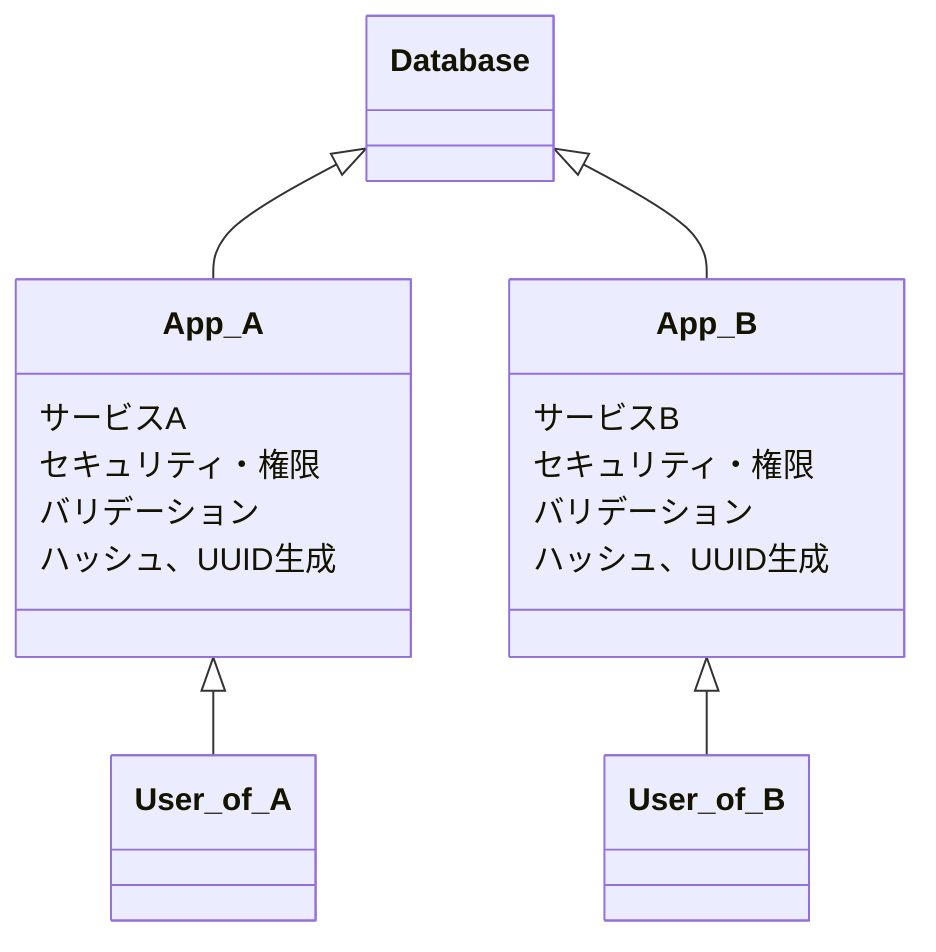
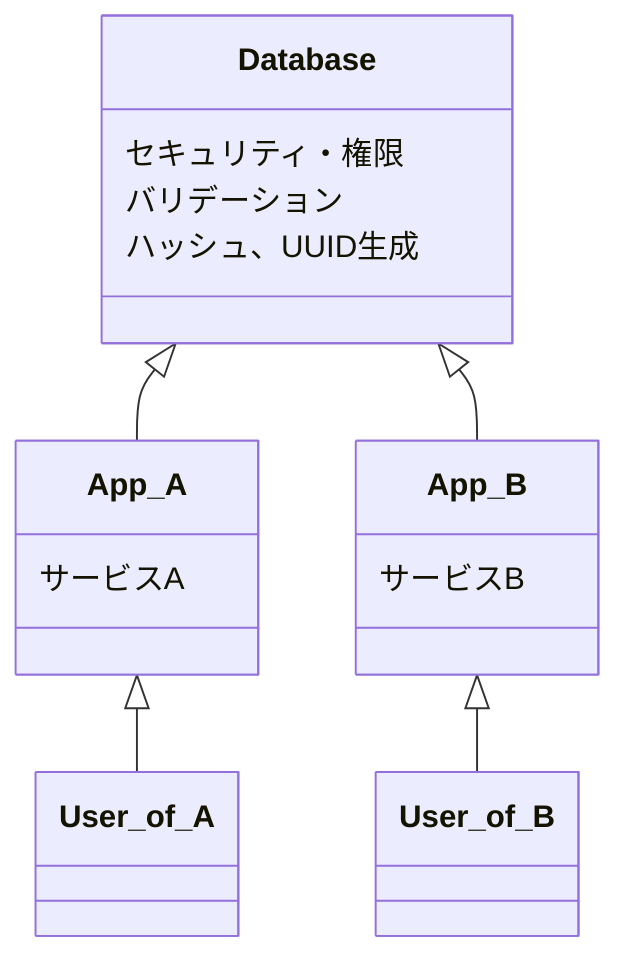
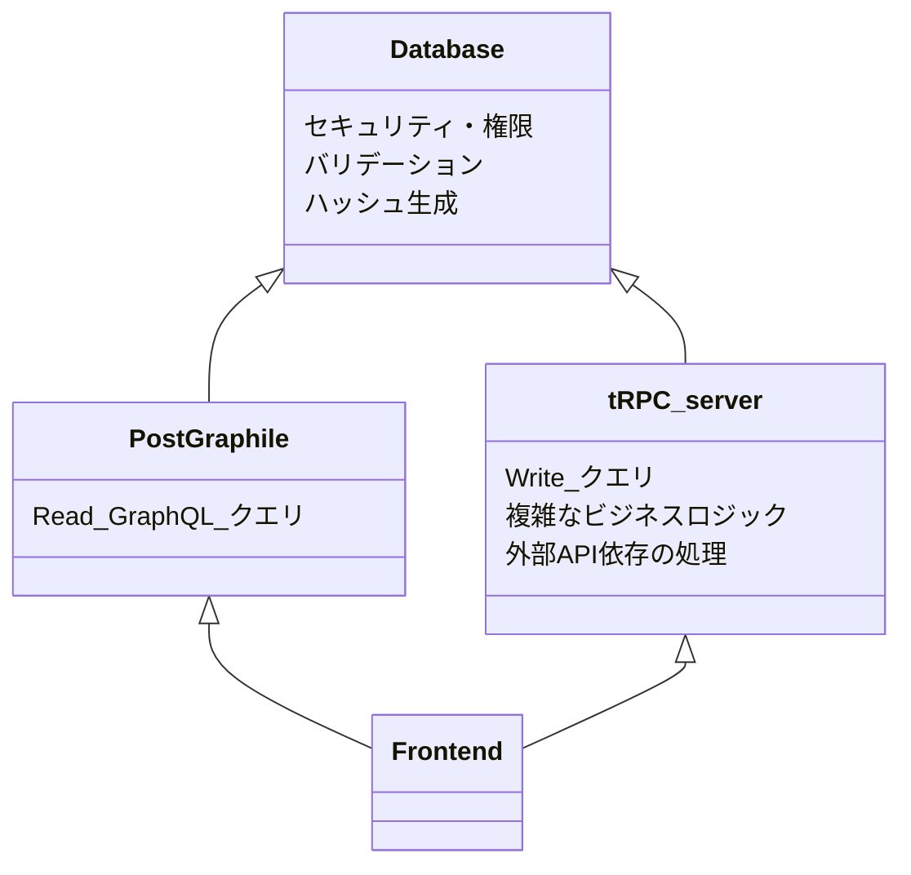

# TL;DR

- 手動で GraphQL API を実装するのは辛い
- Postgraphile で DB のテーブルスキーマから GraphQL API を自動生成できる
- DB駆動開発は安全かつ宣言的

## GraphQL実装したい...が辛い

- REST API
- GraphQL
- tRPC

Webで代表的なAPI形式は上記3つで、上から順に歴史が古い。
新しい物は古い物の欠点を解消しようとして生まれてくるものである。

個人的な感覚として、↓のイメージ

- tRPC >>> REST (ほぼ上位互換)
- GraphQL と tRPC はお互い取って代われない

GraphQL は柔軟なクエリOver/Under fetchingが解消出来るので利用する側にとって嬉しい形式。
...が、実装者にとっては辛い感がある。

- すべてのフィールドのリゾルバ実装の手間
- クエリの効率性 (すぐ N+1問題にぶつかる)

スクラッチで実装するには必要な知識と手間が多い...

## じゃあコード書くやめよう

> コードをすばやく実装するために最も良い方法は、あまりコードを書かないことである。そして、バグを減らすために最も良い方法も、あまりコードを書かないことである。

https://ja.wikipedia.org/wiki/YAGNI

[PostGraphile](https://postgraphile.org) というOSSがある。
DBのテーブル定義から GraphQL サーバーを自動実装してくれるという素敵なやつ。

DBが既に用意されているのなら、↓だけで開始できる

```sh
export DATABASE_URL=...

npx postgraphile -c $DATABASE_URL

```


リレーションのJOINを含む複数種類のデータ取得を一つのSQLにまとめて計画的にやってくれる(N+1の解決)し、実装の手間もかからない。
更に、本体はNodeJSアプリケーションであり高度にカスタマイズ出来る。

(似たようなOSSに [Hasura](https://hasura.io) があるが、カスタマイズ性とスタンドアロン性の点で Postgraphile のが好み)


## DB駆動開発

APIは自動生成されるため、APIの実装者はデータベース構造を考えることだけに集中できる。
最適なIndexを貼る、カラムの制約や可視性など、一般的なDB設計がそのままAPIの機能向上につながる

また、DBに処理を集約することで、複数のアプリケーションで共通の処理を集約することが出来るため大規模なサービスで実装を単純化することが出来る


こういう構成があった場合、



共通の機能をDBに寄せることでこうなるイメージ



- どのリソースにアクセスできるかの権限設定
- 投入するデータのバリデーション
- uuidのバージョン、ハッシュ生成方式

など、複数のサービスで重複したり認識違いが発生しそうなものをDBに寄せて、どのサービスでも同じ挙動をするようになる。

また、バリデーションやセキュリティもDBレベルで設定されていることで、宣言的なアプローチとなり漏れが生じづらい。


### DB で処理を行うことのデメリット

- 書き込みコストが増える？

ただ、書き込み
(Redis, MongoDB, DynamoDB など NoSQL)


### 実装の自由度を補う

自動生成系のツールはスクラッチと比べて、実装の自由度が低いという問題はある。
Read APIのみをPostgraphileに任せて、複雑なビジネスロジックやWrite系の操作は別途RESTやtRPCサーバーを立てて任せるという手もある。
(SQL Function を書くプロなら、複雑なロジックも全部Postgraphileで出来そうだが...)



しっかりDBを設計していれば、PostGraphileとtRPCサーバーで同じデータセキュリティ・バリデーションを利用でき、余計な処理を考えず重要なロジック部分のみに注力して開発することが出来る。


## 余談

MySQL vs PostgreSQL の対立って結構見るけど、 Postgraphile がある時点で PostgreSQL 圧勝じゃないか...?
(MySQLで似たようなの見たこと無い)
ライセンス周りの制約がない分、こういった周辺OSSが生まれやすいのかもしれない。


## まとめ

- GraphQL APIを手書きするより、Postgraphile使おう
  - 開発速度も早く、パフォーマンスも良くなる
- DB駆動開発しよう

気が向いたらDB駆動のAPI開発の実践的なテクもまとめたい
(SQL関数とかTriggerの使い方的な)