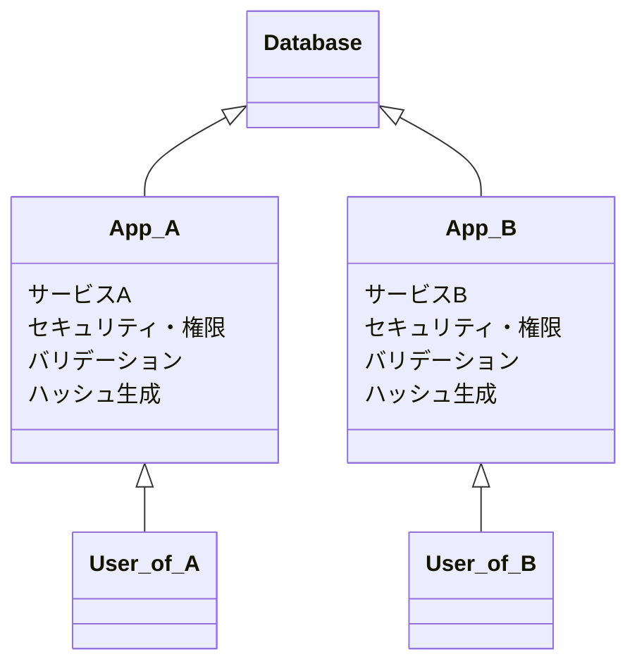
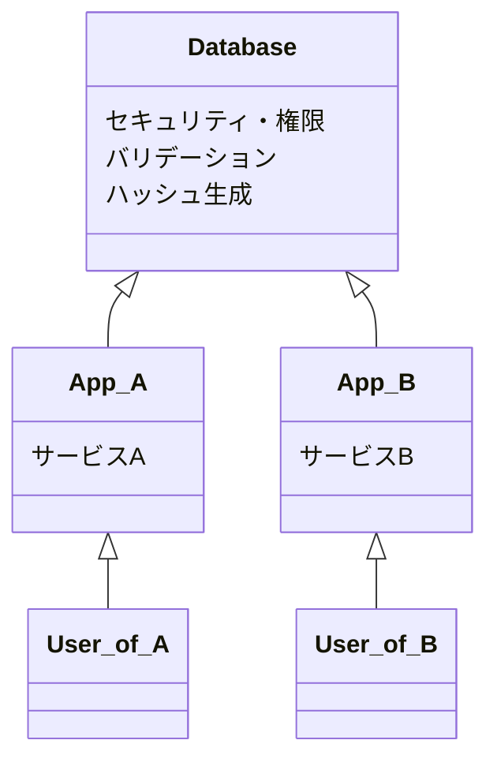
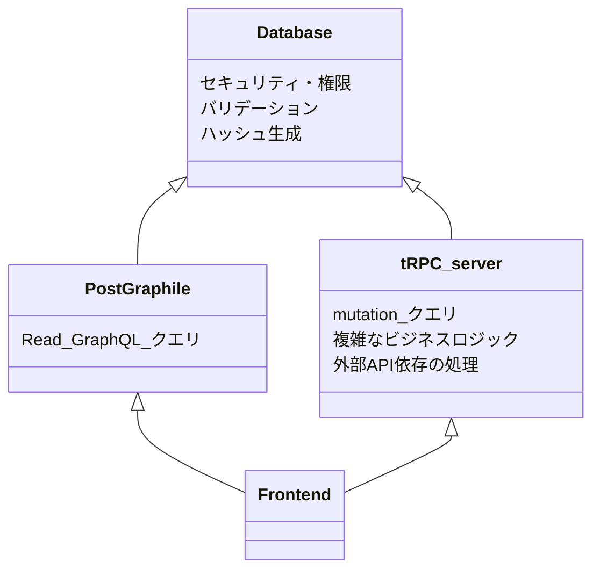

遅ればせながら、2024年にもなって初めてGraphQLサーバー実装周りを勉強し始めたので思ったことを書く

## GraphQLに求められること

- REST API
- GraphQL
- tRPC

Webで代表的なAPI形式は上記3つで、上から順に歴史が古い。
新しい物は古い物の欠点を解消しようとして生まれてくるものである。

||REST|GraphQL|tRPC|
|---|---|---|---|
|代表的 FW|Express|Apollo Server|tRPC|
|インターフェース|OpenAPI|SDL(Schema Definition Language)|TS型|
|型生成|❌ ツールが必要|❌ ツールが必要|⭕️ 不要 (実装から型をexportするだけ)|
|汎用性|⭕️|⭕️|⭕️ OpenAPIを自動生成しRESTとしても使える|
|実装の容易さ|⭕️ 直感に近い|❌ クエリが自由なため、負荷予測がし辛い|⭕️ RESTと同等|
|クエリの柔軟性|❌|⭕️|❌|
|解決したもの||Over/Under fetching 仕様に組み込まれたインターフェース(SDL)|E2Eの型保証 インターフェースのためのツールの排除 (実装の型と仕様が自然と一致する)|

tRPCはRESTの上位互換。
GraphQLは `クエリの柔軟性` で上回るが、その他は tRPC が上回る。

単純な星取表のようで、実際には各項目には重みがある。
`クエリの柔軟性` があることでフロントエンド実装はデータ取得の自由さを手に入れ、プロジェクト全体の開発速度を向上するための重要なファクターと思える。
GraphQL というのはサーバー担当者の立場では実装が大変だが、フロント担当者の立場からは好ましいAPIなのだと思われる。(自分の考えでは)

その点が、最も新しい tRPC でも完全に互換できないGraphQLのメリットと言えそう。

## 脱・GraphQL サーバー スクラッチ

APIをリソースサーバーとして考えるのであれば、基本必要なAPIはCRUD操作である。
そして、多くの場合は RDB にテーブルを作成し、そのテーブル内のリソースに対してアクセスする手段としてAPIを実装するはず。(で、このCRUD操作の実装というのが大抵の場合は車輪の再開発であることが多い。)

また、通信の効率性と行ったところから複数のDBリソースをJOINして一気に取得したいとも考えるだろう。
ただ、スクラッチでGraphQLサーバーを実装すると、容易にN+1問題などパフォーマンス上の問題にぶつかる(と感じた)。それを認知するには常にクエリ最適化の意識を頭の済に置く必要があり、解決するには多少のハックが必要。

GraphQLサーバーを実装するにあたって、 `CRUD APIという車輪の再開発` と `クエリの効率性の問題` を2点の問題を解決する方法がある。
... **実装を書かなければ良い**

### DBのテーブル定義からGraphQL APIを自動実装する

DBテーブル定義からAPIを自動生成するというのは、車輪の再開発の回避として誰もが一度は思うところであると思われ、 PostgREST や PostGraphile, Hasura といったOSSが存在する。

また、これらのツールはリクエストとして受け取ったGraphQLを効率的なSQLに変換するということに主軸を起き、リソースのJOINや複数種類リソースを同時に取得するGraphQLリクエストを1つのSQLにまとめて実行する。

おそらくこれを手動で実装するには、クエリ計画やGraphQLリゾルバー実装のハックが必要でハードルが高い。
が、これらのツールを使うことで容易にパフォーマンスの高いGraphQLサーバーを実装することが出来る。

## DB駆動開発

APIにPOSTするデータのバリデーション、は週の生成やリソースの操作権限などをサーバーアプリ側で実装しているケースは非常に多い。
が、そういった処理は実はDBでも出来る。(いわゆるストアド・プロシージャというやつ)

PostgreSQL の場合

- セキュリティ
  - Role
  - Row Level Security
- データのバリデーション
  - CHECK節
  - Function + Trigger
- ハッシュ
  - `pgcrypt`
  - `uuid-ossp`

これだけ機能があるのだが、恥ずかしながらあまり使ったことがなかった。
が、データベースレベルでこれらの処理を実装することは大いにメリットがあると考えられる。

例えば同じデータベースを使う複数のアプリケーションがある場合

A と B はそれぞれDBのデータを使うのに同じ権限機能や同じデータバリデーションの重複したロジックを別々のコードでそれぞれ重複して実装している。

- A と B は別チームがそれぞれ開発しており、ロジック部分のコード共有が難しいかもしれない
- A と B は違うプログラミング言語で実装されているかもしれない
- A と B は(意思疎通が取れておらず)DBに入れるデータに使うハッシュ生成アルゴリズムを統一していないかもしれない

こういった場合に、DBレベルでセキュリティ・バリデーションを実装すれば不要な実装の重複を取り除くことが出来る。

### 実装の自由度を補う

自動生成系のツールはスクラッチと比べて、実装の自由度が低いという問題はある。

例えば PostGraphile で自動生成される CRUD 以外の複雑な mutation を実装したい場合は、 SQL Function を書くが、 pl/pgsql 言語の表現力には限界があるし、代わりに javascript や python でSQL関数を書くことも出来るものの外部モジュールを使うことは出来ない。何より、型が無いのでランタイムエラーが発生する危険もある。
そう考えると複雑なロジックはやはり TypeScript で書きたい。

そこで、基本的な Read は PostGraphile で自動生成し、複雑なロジックは tRPC サーバーを別途実装して補うという手が考えられる

しっかりDBを設計していれば、PostGraphileとtRPCサーバーで同じデータセキュリティ・バリデーションを利用でき、余計な処理を考えず重要なロジック部分のみに注力して開発することが出来る。

## 余談

どっちも軽く触った感想として、 Hasura か PostGraphile か、なら PostGraphile派。
前者は Haskell, 後者は Node.js アプリケーションで、コンパイル言語の差で前者のパフォーマンスが優れている気がするが複雑なロジックはHTTP Action で別のサーバーに逃がす手法を取っており、後者の方はJavascriptでカスタマイズしやすくスタンドアロン性が高いと感じたため。
(もっと深く使ってみると別の感想がでるのかもしれないが)

使用するDBについては、MySQLかPostgreSQLか、ならPostgreSQLだろう。
パフォーマンスについては絶対的な差があるような話を聞いたことがなく、後者のほうが機能が豊富で付随するOSSが多いため。

ただ、Edge で SQLite を動かすのがトレンドっぽく(Cloudflare D1 や Turso など)、速度の SQLite か機能の PostgreSQL か、という対立軸が昨今の風潮かもしれない。

## まとめ

- GraphQL をフルスクラッチで実装するな
  - 単純なCRUD程度はDBから自動生成出来るOSSがあるため、手書きするのは無駄
  - 手で書くより効率的なSQL実行パフォーマンスを得ることが出来る
- DB駆動開発をせよ
  - PostgreSQLなら、セキュリティはDBにある Role と Row Level Security で実現するべし
  - バリデーションやセキュリティをDB側でしっかり作っておけば、アプリが複数あっても実装の重複を減らせるしDBレベルで安全 
- 自動実装されたAPIの不自由さは別のtRPCサーバーを立てて補う(複雑なlogicやmutationなど)
