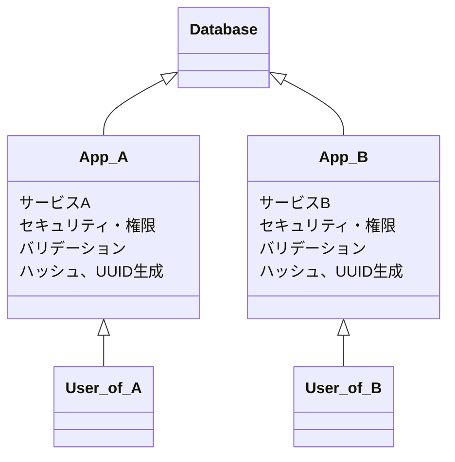
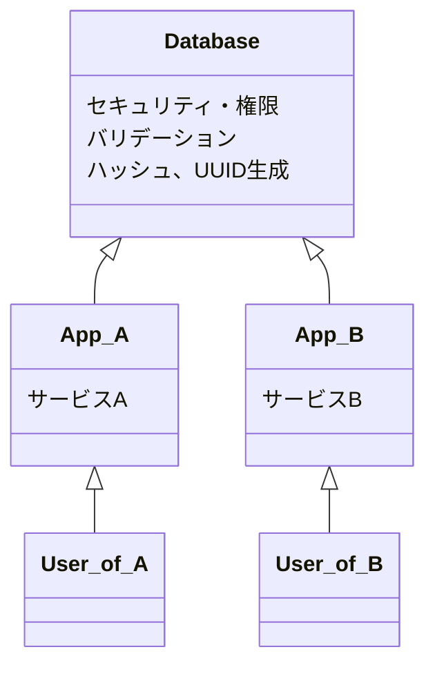
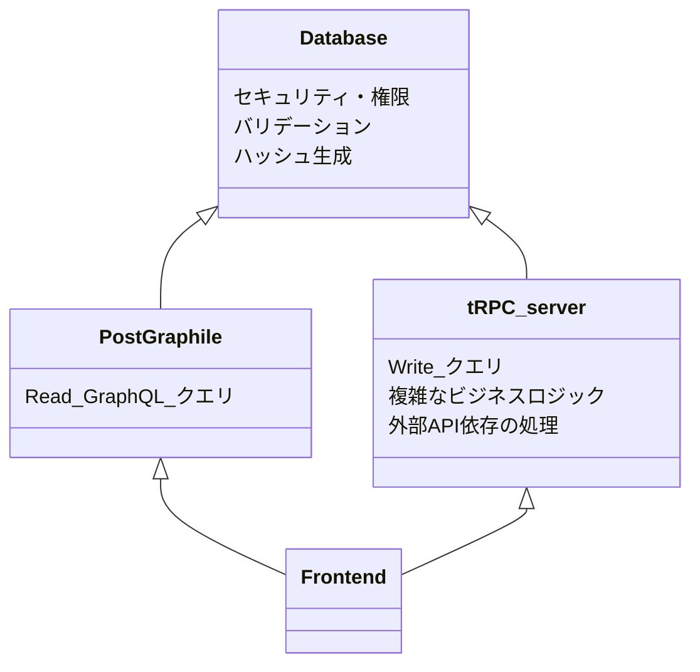

# TL;DR

- 手動で GraphQL API を実装するのは辛い
- Postgraphile で DB のテーブルスキーマから GraphQL API を自動生成できる
- DB 駆動開発は安全かつ宣言的

## GraphQL実装したい...が辛い

- REST API
- GraphQL
- tRPC

Web で代表的な API 形式は上記の 3 つで、上から順に歴史が古い。
新しい物は古い物の欠点を解消しようとして生まれてくるものです。

個人的な感覚として、↓のイメージ

- tRPC ＞ REST（ほぼ上位互換）
- GraphQL と tRPC はお互い取って代われない

GraphQL は柔軟なクエリ Over/Under fetching が解消できるので利用する側にとって嬉しい形式。
…が、実装者にとっては辛い感がある。

- すべてのフィールドのリゾルバ実装の手間
- クエリの効率性（すぐ N+1 問題にぶつかる）

スクラッチで実装するには必要な知識と手間が多い…

## じゃあコード書くやめよう

> コードをすばやく実装するために良い方法は、あまりコードを書かないことである。そして、バグを減らすために良い方法も、あまりコードを書かないことである。

https://ja.wikipedia.org/wiki/YAGNI

[PostGraphile](https://postgraphile.org) という OSS がある。
DB のテーブル定義から GraphQL サーバーを自動実装してくれるという素敵なやつ。

DB がすでに用意されているのなら、↓だけで開始できる

```sh
export DATABASE_URL=...

npx postgraphile -c $DATABASE_URL

```


リレーションの JOIN を含む複数種類のデータ取得を 1 つの SQL にまとめて計画的にやってくれる（N+1 の解決）し、実装の手間もかからない。
さらに、本体は NodeJS アプリケーションであり高度にカスタマイズできる。

（似たような OSS に [Hasura](https://hasura.io) があるが、カスタマイズ性とスタンドアロン性の点で Postgraphile のが好み）


## DB駆動開発

API は自動生成されるため、API の実装者はデータベース構造を考えることだけに集中できる。
最適な Index を貼る、カラムの制約や可視性など、一般的な DB 設計がそのまま API の機能向上につながる

また、DB に処理を集約することで、複数のアプリケーションで共通の処理を集約できるため大規模なサービスで実装を単純化できる。


こういう構成があった場合、



共通の機能を DB に寄せることでこうなるイメージ



- どのリソースにアクセスできるかの権限設定
- 投入するデータのバリデーション
- uuid のバージョン、ハッシュ生成方式

など、複数のサービスで重複したり認識違いが発生しそうなものを DB に寄せて、どのサービスでも同じ挙動をするようになる。

また、バリデーションやセキュリティーも DB レベルで設定されていることで、宣言的なアプローチとなり漏れが生じづらい。


### DB で処理を行うことのデメリット

- 書き込みコストが増える？

ただ、書き込み
（Redis, MongoDB, DynamoDB など NoSQL）


### 実装の自由度を補う

自動生成系のツールはスクラッチと比べて、実装の自由度が低いという問題はある。
Read API のみを Postgraphile に任せて、複雑なビジネスロジックや Write 系の操作は別途 REST や tRPC サーバーを立てて任せるという手もある。
（SQL Function を書くプロなら、複雑なロジックも全部 Postgraphile で出来そうだが…）



しっかり DB を設計していれば、PostGraphile と tRPC サーバーで同じデータセキュリティ・バリデーションを利用でき、余計な処理を考えず重要なロジック部分のみに注力して開発できる。


## まとめ

- GraphQL API を手書きするより、Postgraphile 使おう
  - 開発速度も早く、パフォーマンスも良くなる
- DB 駆動開発しよう

気が向いたら DB 駆動の API 開発の実践的なテクもまとめたい
（SQL 関数とか Trigger の使い方的な）